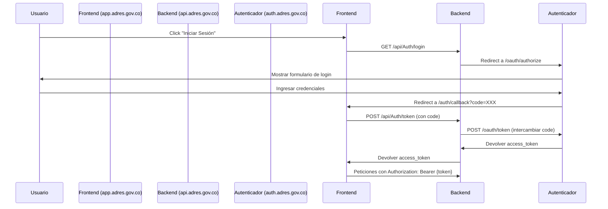

# 🔐 URLs para Configuración del Autenticador Externo

## 📋 Información General

Este documento contiene las URLs que deben ser configuradas en el sistema de autenticación externo (proveedor OAuth/OIDC) para los ambientes de **Staging** y **Producción**.

---

## 🟡 STAGING

### **Información del Cliente**
- **Client ID / Audience**: `adres-api`
- **Nombre de la Aplicación**: ADRES - Sistema de Gestión (Staging)

### **URLs de Callback (Redirect URIs)**

URLs donde el autenticador debe redirigir después de una autenticación exitosa:

```
https://app.staging.adres.gov.co/auth/callback
https://api.staging.adres.gov.co/api/Auth/callback
```

### **URL de Logout (Post Logout Redirect URI)**

URL donde el autenticador debe redirigir después de cerrar sesión:

```
https://app.staging.adres.gov.co
```

### **URL de Error**

URL donde el autenticador debe redirigir en caso de error:

```
https://app.staging.adres.gov.co/auth/error
```

### **Orígenes Permitidos (CORS)**

Dominios desde donde se realizarán peticiones al autenticador:

```
https://app.staging.adres.gov.co
https://api.staging.adres.gov.co
```

### **URLs de Inicio de Sesión**

URLs que el frontend usará para iniciar el flujo de autenticación:

```
GET https://api.staging.adres.gov.co/api/Auth/login
GET https://api.staging.adres.gov.co/api/Auth/logout
```

---

## 🔴 PRODUCCIÓN

### **Información del Cliente**
- **Client ID / Audience**: `adres-api`
- **Nombre de la Aplicación**: ADRES - Sistema de Gestión

### **URLs de Callback (Redirect URIs)**

URLs donde el autenticador debe redirigir después de una autenticación exitosa:

```
https://app.adres.gov.co/auth/callback
https://api.adres.gov.co/api/Auth/callback
```

### **URL de Logout (Post Logout Redirect URI)**

URL donde el autenticador debe redirigir después de cerrar sesión:

```
https://app.adres.gov.co
```

### **URL de Error**

URL donde el autenticador debe redirigir en caso de error:

```
https://app.adres.gov.co/auth/error
```

### **Orígenes Permitidos (CORS)**

Dominios desde donde se realizarán peticiones al autenticador:

```
https://app.adres.gov.co
https://api.adres.gov.co
```

### **URLs de Inicio de Sesión**

URLs que el frontend usará para iniciar el flujo de autenticación:

```
GET https://api.adres.gov.co/api/Auth/login
GET https://api.adres.gov.co/api/Auth/logout
```

---

## 🔧 Configuración Requerida en el Autenticador

### **1. Scopes (Ámbitos) Requeridos**
```
openid
profile
email
roles
permissions
```

### **2. Response Types Permitidos**
```
code (Authorization Code Flow)
```

### **3. Grant Types Permitidos**
```
authorization_code
refresh_token
```

### **4. Token Endpoint Authentication Method**
```
client_secret_post
```

### **5. Información en el Token JWT**

El token JWT debe incluir los siguientes claims:

```json
{
  "sub": "identificador-único-usuario",
  "email": "usuario@ejemplo.com",
  "name": "Nombre Completo",
  "esRepresentanteLegal": "true|false",
  "roles": ["Admin", "Analista"],
  "permissions": ["CONSULTAR_PAGOS", "CREAR_SOLICITUD"],
  "exp": 1234567890,
  "iat": 1234567890,
  "iss": "https://auth.adres.gov.co",
  "aud": "adres-api"
}
```

---

## 📊 Flujo de Autenticación



---

## 🔐 Seguridad

### **HTTPS Obligatorio**
- ✅ Todas las URLs deben usar HTTPS en staging y producción
- ❌ HTTP solo permitido en desarrollo local

### **CORS**
- El autenticador debe permitir peticiones desde:
  - `https://app.staging.adres.gov.co` (Staging)
  - `https://app.adres.gov.co` (Producción)

### **Validación de Redirect URIs**
- El autenticador debe validar estrictamente que las redirect URIs coincidan con las configuradas
- No permitir wildcards ni URLs dinámicas

---

## 📞 Contacto

Para configuración o problemas con el autenticador, contactar a:

- **Equipo de Desarrollo**: dev@adres.gov.co
- **Equipo de Infraestructura**: infra@adres.gov.co

---

## 📝 Notas Adicionales

### **Desarrollo Local**
Para pruebas locales, usar:
- Frontend: `http://localhost:3000`
- Backend: `http://localhost:8080`
- Callback: `http://localhost:3000/auth/callback`

### **Testing**
Crear un usuario de prueba en el autenticador con:
- Email: `test@adres.gov.co`
- Roles: `["Admin", "Analista"]`
- `esRepresentanteLegal`: `true`

---

**Última Actualización**: Octubre 2025  
**Versión**: 1.0
